<p align="center">
  
</p>

<h1 align="center">Hoofy</h1>

<p align="center">
  <strong>The AI coding assistant that remembers everything and never hallucinates specs.</strong><br>
  An MCP server that gives your AI persistent memory, structured specifications,<br>
  and adaptive change management — so it builds what you actually want.
</p>

<p align="center">
  <a href="https://github.com/HendryAvila/Hoofy/actions/workflows/ci.yml"></a>
  <a href="https://go.dev"></a>
  <a href="https://modelcontextprotocol.io"></a>
  <a href="LICENSE"></a>
  <a href="https://github.com/HendryAvila/Hoofy/releases"></a>
</p>

<p align="center">
  <a href="https://hendrycode.xyz/blog/2026/2/25/hoofy-tu-companion-de-desarrollo-con-ia-que-no-te-deja-cortar-camino/">Blog Post</a> ·
  <a href="docs/workflow-guide.md">Workflow Guide</a> ·
  <a href="docs/tool-reference.md">Tool Reference</a> ·
  <a href="docs/research-foundations.md">Research Foundations</a> ·
</p>

<p align="center">
  <a href="https://hendryavila.github.io/Hoofy/"><strong>🐴 Explore the Interactive Documentation →</strong></a>
</p>

---

## What Is Hoofy? — AI Development Companion for MCP

Hoofy is an AI coding tool that solves the three biggest problems with AI-assisted development: **memory loss between sessions**, **hallucinated implementations**, and **unstructured AI workflows**. It's a single [MCP (Model Context Protocol)](https://modelcontextprotocol.io) server written in Go — one binary, zero dependencies — that works with Claude Code, Cursor, VS Code Copilot, Gemini CLI, OpenCode, and any MCP-compatible AI tool.

Hoofy is four systems in one MCP server:

| System | What it does | Tools |
|---|---|---|
| **Memory** | Persistent context across sessions using SQLite + FTS5 full-text search. Decisions, bugs, patterns, discoveries — your AI remembers what happened yesterday. | 19 `mem_*` tools |
| **Change Pipeline** | Adaptive workflow for ongoing dev. Picks the right stages based on change type × size (12 flow variants). Includes mandatory **context-check** and **artifact guard** stages. | 5 `sdd_change*` + `sdd_adr` |
| **Project Pipeline** | Full greenfield specification — from vague idea to validated architecture with a Clarity Gate, **principles** declaration, and **business rules extraction** that blocks hallucinations. 9-stage pipeline: init → principles → charter → specify → business-rules → clarify → design → tasks → validate. | 12 `sdd_*` tools |
| **Bootstrap** | Reverse-engineer existing codebases into SDD artifacts. Scans project structure, configs, conventions, schemas, and tests — then generates requirements, business rules, and design docs. | `sdd_reverse_engineer` + `sdd_bootstrap` |

One binary. Zero external dependencies. SQLite embedded at compile time. Works with **any** MCP-compatible AI coding assistant — Claude Code, Cursor, VS Code Copilot, Gemini CLI, OpenCode. **40 tools + 6 on-demand prompts.**

### Why Hoofy?

AI coding assistants are powerful but forgetful and overconfident. Studies show experienced developers are [19% slower with unstructured AI](https://metr.org/blog/2025-07-10-early-2025-ai-experienced-os-dev-study/) (METR 2025), and AI adoption without structure causes [7.2% delivery instability](https://dora.dev/research/2025/dora-report/) (DORA 2025). Hoofy fixes this by making your AI assistant remember context, follow specifications, and prove it understood before writing code.

### Key Features

**Principles-First Pipeline** — Before writing a single requirement, the pipeline now captures **golden invariants** — project principles, coding standards, and domain truths that remain constant throughout the project lifecycle. These anchor every subsequent stage: requirements must respect principles, designs must implement them, and the Clarity Gate evaluates against them.

**Project Charter** — The old "proposal" stage is now a **charter** — an enterprise-grade project definition with expanded fields: domain context, stakeholders, vision, boundaries, success criteria, existing systems, and constraints. Four required fields keep it lightweight for small projects; six optional fields scale up for enterprise use.

**Spec-vs-Code Audit** — `sdd_audit` compares your specifications against actual source code and reports discrepancies: missing implementations, stale specs, and inconsistencies. Read-only scanner — produces a structured report for the AI to analyze. Works standalone without an active pipeline.

**Auto-Generated Agent Instructions** — `sdd_init_project` now auto-generates an SDD instructions section in your project's agent file (CLAUDE.md, AGENTS.md, or creates AGENTS.md). Idempotent — won't duplicate if already present. Ensures every developer's AI knows about the project's specs from the first session.

**Unified ADR Storage** — Architecture Decision Records are always stored in `docs/adrs/` with sequential `NNN-slug.md` naming. No more scattered ADRs — standalone ADRs get files too (previously memory-only). `nextADRNumber()` handles gaps gracefully.

**Hot/Cold Instruction Architecture** — Server instructions are kept minimal (~160 lines of "constitution") to reduce token overhead. Detailed guidance for specific workflows is loaded on-demand via 6 MCP prompts (`/sdd-start`, `/sdd-status`, `/sdd-stage-guide`, `/sdd-memory-guide`, `/sdd-change-guide`, `/sdd-bootstrap-guide`). The AI requests the right prompt when it needs it — like loading a manual chapter instead of carrying the entire book. Inspired by research showing that compact constitutions with on-demand retrieval reduce token consumption by ~17%.

**Spec-Aware Code Review** — `sdd_review` runs a code review against your project's specifications, not just generic best practices. It parses requirements (FR-XXX), business rules (BRC-XXX constraints), design decisions, and ADRs from memory to generate a review checklist. Works standalone — no active pipeline needed. Give it a task description and it tells you what to verify.

**Ad-Hoc Context Suggestion** — `sdd_suggest_context` bridges the gap for sessions that don't use a formal pipeline. Give it a task description and it scans your specs, completed changes, memory observations, and project conventions to recommend what context to read before starting. Works without `hoofy.json` or an active change.

**Existing Project Bootstrap** — Got an existing codebase with no specs? `sdd_reverse_engineer` scans your project (directory structure, package manifests, configs, entry points, conventions, schemas, API definitions, ADRs, tests) and produces a structured report. Then `sdd_bootstrap` writes the missing SDD artifacts — requirements, business rules, and design docs — so the change pipeline works intelligently from day one. Medium/large changes are **blocked** without artifacts; small changes get a warning.

**Knowledge Graph** — Memory observations aren't flat notes. You can connect them with typed, directional relations (`depends_on`, `caused_by`, `implements`, `supersedes`, `relates_to`, `part_of`) to build a navigable web of project knowledge. Use `mem_build_context` to traverse the graph from any observation and pull in related decisions, bugs, and patterns automatically.

```
Decision: "Switched to JWT"  →(caused_by)→  Discovery: "Session storage doesn't scale"
    ↑(implements)                               ↑(relates_to)
Bugfix: "Fixed token expiry"              Pattern: "Retry with backoff"
```

**Context Check** — Every change pipeline flow now starts with a mandatory context-check stage. Before writing a single spec or line of code, Hoofy scans your existing specs, completed changes, memory observations, and convention files (`CLAUDE.md`, `AGENTS.md`, `CONTRIBUTING.md`, etc.) to detect conflicts and ambiguities. Zero issues = green light. Issues found = must resolve before proceeding. Even a one-line fix can break an existing business rule.

**Business Rules** — In the greenfield project pipeline, a dedicated business-rules stage extracts declarative rules from your requirements using BRG taxonomy (Definitions, Facts, Constraints, Derivations) and DDD Ubiquitous Language — before the Clarity Gate evaluates them. Rules inform the gate, not the other way around.

**Pre-pipeline Exploration** — Before committing to a pipeline, use `sdd_explore` to capture unstructured thinking — goals, constraints, tech preferences, unknowns, decisions. It saves structured context to memory via topic key upsert (call it multiple times as your thinking evolves — it updates, never duplicates). It also suggests a change type and size based on keywords, so you start the right pipeline.

**Wave Assignments** — When creating tasks (in either pipeline), the AI can group them into parallel execution waves derived from the dependency graph. Wave 1 has no dependencies, Wave 2 depends only on Wave 1, and so on. This tells you exactly which tasks can run in parallel and which must wait — useful for team coordination or just knowing the critical path.

### How it flows

```mermaid
flowchart TB
    explore["sdd_explore\n(goals, constraints, unknowns)"]

    subgraph project ["New Project (greenfield)"]
        direction LR
        P1[Init] --> P1b[Principles] --> P2[Charter] --> P3[Requirements] --> P3b["Business\nRules"]
        P3b --> P4{Clarity Gate}
        P4 -->|Ambiguous| P3
        P4 -->|Clear| P5[Design] --> P6[Tasks] --> P7[Validate]
    end

    subgraph bootstrap ["Existing Project (no specs)"]
        direction LR
        B1["sdd_reverse_engineer\n(scan codebase)"] --> B2["AI analyzes\nreport"] --> B3["sdd_bootstrap\n(write artifacts)"]
    end

    subgraph change ["Existing Project (changes)"]
        direction LR
        C1["sdd_change\n(type × size)"] --> C1b["Context\nCheck"]
        C1b --> C2["Opening Stage\n(describe/charter/scope)"]
        C2 --> C3["Spec + Design\n(if needed)"]
        C3 --> C4[Tasks] --> C5[Verify]
    end

    subgraph memory ["Memory (always active)"]
        direction LR
        M1[Session Start] --> M2["Work + Save Discoveries"]
        M2 --> M3["Connect with Relations"]
        M3 --> M4[Session Summary]
    end

    explore -.->|"captures context before"| project
    explore -.->|"captures context before"| change
    bootstrap -.->|"enables"| change

    style explore fill:#8b5cf6,stroke:#7c3aed,color:#fff
    style P4 fill:#f59e0b,stroke:#d97706,color:#000
    style P1b fill:#e879f9,stroke:#c026d3,color:#000
    style P3b fill:#e879f9,stroke:#c026d3,color:#000
    style C1b fill:#e879f9,stroke:#c026d3,color:#000
    style B1 fill:#06b6d4,stroke:#0891b2,color:#fff
    style B3 fill:#06b6d4,stroke:#0891b2,color:#fff
    style P7 fill:#10b981,stroke:#059669,color:#fff
    style C5 fill:#10b981,stroke:#059669,color:#fff
```



> **[Full workflow guide with step-by-step examples](docs/workflow-guide.md)** · **[Complete tool reference (40 tools)](docs/tool-reference.md)**

---

## Quick Start

### 1. Install the binary

<details open>
<summary><strong>macOS</strong> (Homebrew)</summary>

```bash
brew install HendryAvila/hoofy/hoofy
```
</details>

<details>
<summary><strong>macOS / Linux</strong> (script)</summary>

```bash
curl -sSL https://raw.githubusercontent.com/HendryAvila/Hoofy/main/install.sh | bash
```
</details>

<details>
<summary><strong>Windows</strong> (PowerShell)</summary>

```powershell
irm https://raw.githubusercontent.com/HendryAvila/Hoofy/main/install.ps1 | iex
```
</details>

<details>
<summary><strong>Go / Source</strong></summary>

```bash
# Go install (requires Go 1.25+)
go install github.com/HendryAvila/Hoofy/cmd/hoofy@latest

# Or build from source
git clone https://github.com/HendryAvila/Hoofy.git
cd Hoofy
make build
```
</details>

### 2. Connect to your AI tool

> **MCP Server vs Plugin — what's the difference?**
>
 > The **MCP server** is Hoofy itself — the binary you just installed. It provides 40 tools and 6 on-demand prompts (memory, change pipeline, project pipeline, bootstrap, standalone) and works with **any** MCP-compatible AI tool.
>
> The **Plugin** is a Claude Code-only enhancement that layers additional capabilities on top of the MCP server:
>
> | Component | What it does |
> |---|---|
> | **Agent** | A custom personality (Hoofy the horse-architect) that teaches through concepts, not code dumps. Enforces SDD discipline — the AI won't skip specs. |
> | **Skills** | Loadable instruction sets for specific domains (React 19, Next.js 15, TypeScript, Tailwind 4, Django DRF, Playwright, etc.). The agent auto-detects context and loads the right skill before writing code. |
> | **Hooks** | Lifecycle automation — `PreToolCall` and `PostToolCall` hooks that trigger memory operations automatically (e.g., saving session context, capturing discoveries after tool use). |
>
> The plugin is optional — you get full Hoofy functionality with just the MCP server. The plugin just makes the experience smoother in Claude Code.

<details open>
<summary><strong>Claude Code</strong></summary>

**MCP Server** — one command, done:

```bash
claude mcp add --scope user hoofy hoofy serve
```

**Plugin** (optional, Claude Code only) — adds agent + skills + hooks on top of the MCP server:

```
/plugin marketplace add HendryAvila/hoofy-plugins
/plugin install hoofy@hoofy-plugins
```
</details>

<details>
<summary><strong>Cursor</strong></summary>

Add to your MCP config:

```json
{
  "mcpServers": {
    "hoofy": {
      "command": "hoofy",
      "args": ["serve"]
    }
  }
}
```
</details>

<details>
<summary><strong>VS Code Copilot</strong></summary>

Add to `.vscode/mcp.json`:

```json
{
  "servers": {
    "hoofy": {
      "type": "stdio",
      "command": "hoofy",
      "args": ["serve"]
    }
  }
}
```
</details>

<details>
<summary><strong>OpenCode</strong></summary>

Add to `~/.config/opencode/opencode.json` inside the `"mcp"` key:

```json
{
  "mcp": {
    "hoofy": {
      "type": "local",
      "command": ["hoofy", "serve"],
      "enabled": true
    }
  }
}
```
</details>

<details>
<summary><strong>Gemini CLI</strong></summary>

Add to your MCP config:

```json
{
  "mcpServers": {
    "hoofy": {
      "command": "hoofy",
      "args": ["serve"]
    }
  }
}
```
</details>

### 3. Use it

Just talk to your AI. Hoofy's built-in instructions tell the AI when and how to use each system.

### 4. Update

```bash
hoofy update
```

Auto-checks on startup, updates when you say so.

### 5. Reinforce the behavior (recommended)

Hoofy already includes built-in server instructions, but adding a short block to your agent's instructions file reinforces the habit — the AI will think about specs *before* it even sees the tools.

> **Note:** In v1.0, `sdd_init_project` auto-generates this section for you. The instructions below are only needed if you skip the project pipeline.

<details>
<summary><strong>Claude Code</strong> — <code>CLAUDE.md</code> (only needed for MCP-only setup)</summary>

> **Using the plugin?** Skip this — the plugin's hooks and agent already enforce SDD behavior automatically.

```markdown
## Hoofy — Spec-Driven Development

Before coding any new feature or significant change, use Hoofy to create specs first.
- New projects: use the SDD pipeline (sdd_init_project → sdd_validate, 9 stages)
- Existing projects without specs: use sdd_reverse_engineer → sdd_bootstrap to generate artifacts
- Ongoing work: use the change pipeline (sdd_change) — it adapts stages to the size of the change
- Ad-hoc sessions: use sdd_suggest_context to find relevant specs/memory before starting
- Code review: use sdd_review to verify implementation against specs, business rules, and ADRs
- Spec audit: use sdd_audit to compare specs against actual code and find discrepancies
- Memory: save decisions, bugs, and discoveries with mem_save so future sessions have context
Do NOT start coding without specs for any non-trivial change.
```
</details>

<details>
<summary><strong>Cursor</strong> — <code>.cursor/rules/hoofy.md</code></summary>

```markdown
## Hoofy — Spec-Driven Development

Before coding any new feature or significant change, use Hoofy to create specs first.
- New projects: use the SDD pipeline (sdd_init_project → sdd_validate, 9 stages)
- Existing projects without specs: use sdd_reverse_engineer → sdd_bootstrap to generate artifacts
- Ongoing work: use the change pipeline (sdd_change) — it adapts stages to the size of the change
- Ad-hoc sessions: use sdd_suggest_context to find relevant specs/memory before starting
- Code review: use sdd_review to verify implementation against specs, business rules, and ADRs
- Spec audit: use sdd_audit to compare specs against actual code and find discrepancies
- Memory: save decisions, bugs, and discoveries with mem_save so future sessions have context
Do NOT start coding without specs for any non-trivial change.
```
</details>

<details>
<summary><strong>OpenCode</strong> — <code>AGENTS.md</code></summary>

```markdown
## Hoofy — Spec-Driven Development

Before coding any new feature or significant change, use Hoofy to create specs first.
- New projects: use the SDD pipeline (sdd_init_project → sdd_validate, 9 stages)
- Existing projects without specs: use sdd_reverse_engineer → sdd_bootstrap to generate artifacts
- Ongoing work: use the change pipeline (sdd_change) — it adapts stages to the size of the change
- Ad-hoc sessions: use sdd_suggest_context to find relevant specs/memory before starting
- Code review: use sdd_review to verify implementation against specs, business rules, and ADRs
- Spec audit: use sdd_audit to compare specs against actual code and find discrepancies
- Memory: save decisions, bugs, and discoveries with mem_save so future sessions have context
Do NOT start coding without specs for any non-trivial change.
```
</details>

<details>
<summary><strong>VS Code Copilot</strong> — <code>.github/copilot-instructions.md</code></summary>

```markdown
## Hoofy — Spec-Driven Development

Before coding any new feature or significant change, use Hoofy to create specs first.
- New projects: use the SDD pipeline (sdd_init_project → sdd_validate, 9 stages)
- Existing projects without specs: use sdd_reverse_engineer → sdd_bootstrap to generate artifacts
- Ongoing work: use the change pipeline (sdd_change) — it adapts stages to the size of the change
- Ad-hoc sessions: use sdd_suggest_context to find relevant specs/memory before starting
- Code review: use sdd_review to verify implementation against specs, business rules, and ADRs
- Spec audit: use sdd_audit to compare specs against actual code and find discrepancies
- Memory: save decisions, bugs, and discoveries with mem_save so future sessions have context
Do NOT start coding without specs for any non-trivial change.
```
</details>

<details>
<summary><strong>Gemini CLI</strong> — <code>GEMINI.md</code></summary>

```markdown
## Hoofy — Spec-Driven Development

Before coding any new feature or significant change, use Hoofy to create specs first.
- New projects: use the SDD pipeline (sdd_init_project → sdd_validate, 9 stages)
- Existing projects without specs: use sdd_reverse_engineer → sdd_bootstrap to generate artifacts
- Ongoing work: use the change pipeline (sdd_change) — it adapts stages to the size of the change
- Ad-hoc sessions: use sdd_suggest_context to find relevant specs/memory before starting
- Code review: use sdd_review to verify implementation against specs, business rules, and ADRs
- Spec audit: use sdd_audit to compare specs against actual code and find discrepancies
- Memory: save decisions, bugs, and discoveries with mem_save so future sessions have context
Do NOT start coding without specs for any non-trivial change.
```
</details>

---

## Best Practices

### 1. Specs before code — always

The AI will try to jump straight to coding. Don't let it. For any non-trivial work:
- **New project?** → `sdd_init_project` and walk through the full 9-stage pipeline
- **New feature?** → `sdd_change(type: "feature", size: "medium")` at minimum
- **Bug fix?** → Even `sdd_change(type: "fix", size: "small")` gives you context-check → describe → tasks → verify

The cheapest stages (context-check + describe + tasks + verify) take under 2 minutes and save hours of debugging hallucinated code.

### 2. Explore before you plan

Before jumping into a pipeline, use `sdd_explore` to capture context from your discussion — goals, constraints, tech preferences, unknowns, decisions. It saves structured context to memory so the pipeline starts with clarity, not guesswork. Call it multiple times as your thinking evolves — it upserts, never duplicates.

### 3. Bootstrap existing projects

Working on a project that never went through SDD? Don't skip specs — bootstrap them. Run `sdd_reverse_engineer` to scan the codebase, then `sdd_bootstrap` to generate the missing artifacts. This takes under a minute and means the change pipeline works with full context instead of flying blind. Medium/large changes are blocked without specs — and that's intentional.

### 4. Right-size your changes

Don't use a large pipeline for a one-line fix. Don't use a small pipeline for a new authentication system.

| If the change... | It's probably... |
|---|---|
| Touches 1-2 files, clear fix | **small** (4 stages — context-check + describe + tasks + verify) |
| Needs requirements or design thought | **medium** (5 stages) |
| Affects architecture, multiple systems | **large** (6-7 stages) |

### 5. Let memory work for you

You don't need to tell the AI to use memory — Hoofy's built-in instructions handle it. But you'll get better results if you:
- **Start sessions by greeting the AI** — it triggers `mem_context` to load recent history
- **Mention past decisions** — "remember when we chose SQLite?" triggers `mem_search`
- **Confirm session summaries** — the AI writes them at session end, review them for accuracy

### 6. Connect knowledge with relations

Hoofy's knowledge graph lets you connect related observations with typed, directional edges — turning flat memories into a navigable web. The AI creates relations automatically when it recognizes connections. You can also ask it to relate observations manually. Use `mem_build_context` to explore the full graph around any observation.

### 7. Use topic keys for evolving knowledge

When a decision might change (database schema, API design, architecture), use `topic_key` in `mem_save`. This **updates** the existing observation instead of creating duplicates. One observation per topic, always current.

### 8. One change at a time

Hoofy enforces one active change at a time. This isn't a limitation — it's a feature. Scope creep happens when you try to do three things at once. Finish one change, verify it, then start the next.

### 9. Trust the Clarity Gate

When the Clarity Gate asks questions, don't rush past them. Every question it asks represents an ambiguity that would have become a bug, a hallucination, or a "that's not what I meant" moment. Two minutes answering questions saves two hours debugging wrong implementations.

### 10. Hoofy is the architect, Plan mode is the contractor

If your AI tool has a plan/implementation mode, use it **after** Hoofy specs are done. Hoofy answers WHO and WHAT. Plan mode answers HOW.

```
Hoofy (Requirements Layer)  →  "WHAT are we building? For WHO?"
Plan Mode (Implementation)  →  "HOW do we build it? Which files?"
```

---

## The Research Behind SDD

Hoofy's specification pipeline isn't built on opinions. It's built on research. Every feature maps to a specific recommendation from Anthropic Engineering or industry research — see the **[full research foundations document](docs/research-foundations.md)** for the complete mapping.

**Anthropic Engineering:**
- [Building Effective Agents](https://www.anthropic.com/engineering/building-effective-agents) — ACI design, tool patterns, orchestrator-worker architecture
- [Effective Context Engineering](https://www.anthropic.com/engineering/effective-context-engineering-for-ai-agents) — Persistent memory, progressive disclosure, context as finite resource
- [Writing Effective Tools](https://www.anthropic.com/engineering/writing-tools-for-agents) — Tool namespacing, response design, token efficiency
- [Multi-Agent Research System](https://www.anthropic.com/engineering/multi-agent-research-system) — Session summaries, filesystem output, token budget awareness
- [Long-Running Agent Harnesses](https://www.anthropic.com/engineering/effective-harnesses-for-long-running-agents) — Progress tracking, incremental delivery, JSON over Markdown for state
- [Claude Code Best Practices](https://www.anthropic.com/engineering/claude-code-best-practices) — CLAUDE.md scanning, structured workflows

**Industry Research:**
- **METR 2025**: Experienced developers were [19% slower with AI](https://metr.org/blog/2025-07-10-early-2025-ai-experienced-os-dev-study/) despite feeling 20% faster — unstructured AI usage introduces debugging overhead and false confidence.
- **DORA 2025**: [7.2% delivery instability increase](https://dora.dev/research/2025/dora-report/) for every 25% AI adoption — without foundational systems and practices.
- **McKinsey 2025**: Top performers see [16-30% productivity gains](https://www.mckinsey.com/capabilities/mckinsey-digital/our-insights/superagency-in-the-workplace-empowering-people-to-unlock-ais-full-potential-at-work) only with structured specification and communication.
- **IEEE 720574**: Fixing a requirement error in production costs [10-100x more](https://ieeexplore.ieee.org/document/720574) than fixing it during requirements — worse with AI-generated code.
- **Codified Context (Lulla 2026)**: [AGENTS.md infrastructure](https://arxiv.org/abs/2602.20478v1) associated with 29% less runtime and 17% less token consumption. Compact constitutions (~660 lines) with on-demand retrieval outperform monolithic instructions. Hoofy's hot/cold instruction architecture implements this pattern.
- **IREB & IEEE 29148**: Structured elicitation, traceability, ambiguity detection — Hoofy's Clarity Gate implements these frameworks.
- **Business Rules Group**: The [Business Rules Manifesto](https://www.businessrulesgroup.org/brmanifesto.htm) — rules as first-class citizens. Hoofy uses BRG taxonomy.
- **EARS**: [Research-backed sentence templates](https://alistairmavin.com/ears/) that eliminate requirements ambiguity.
- **DDD Ubiquitous Language**: [Shared language](https://martinfowler.com/bliki/UbiquitousLanguage.html) eliminates translation errors — Hoofy's business-rules glossary.
- **Harness Engineering (OpenAI 2026)**: [Structured wrapping of AI](https://cdn.openai.com/papers/harness-engineering-designing-effective-ai-development-tools.pdf) improves output quality by constraining context, enforcing workflows, and making state explicit. Hoofy v1.0's identity redesign was directly inspired by this paper's philosophy of "user brings content, AI complements/organizes/validates."

**Structure beats speed.**

---

## Contributing

```bash
git clone https://github.com/HendryAvila/Hoofy.git
cd Hoofy
make build        # Build binary
make test         # Tests with race detector
make lint         # golangci-lint
./bin/hoofy serve # Run the MCP server
```

### Areas for contribution

- More clarity dimensions (mobile, API, data pipeline)
- More change types beyond fix/feature/refactor/enhancement
- Template improvements and customization
- Streamable HTTP transport for remote deployment
- Export to Jira, Linear, GitHub Issues
- i18n for non-English specs

---

## Acknowledgments

Hoofy's memory system is inspired by [Engram](https://github.com/Gentleman-Programming/engram) by [Gentleman Programming](https://github.com/Gentleman-Programming) — the original persistent memory MCP server that proved AI assistants need long-term context to be truly useful. Engram laid the foundation; Hoofy built on top of it.

---

## License

[MIT](LICENSE)

---

<p align="center">
  <strong>Stop prompting. Start specifying.</strong><br>
  Built with care by the Hoofy community.
</p>
